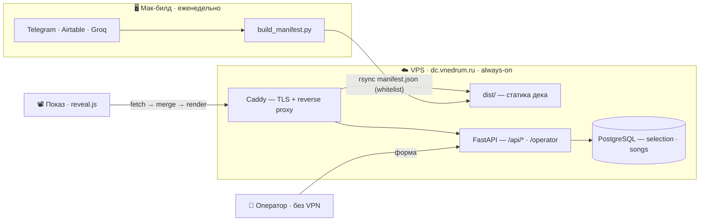

<div align="center">

# 🪷 dc-deck

**Веб-дек еженедельной Дхармачакры.**
Рендерится из данных, а не правится вручную. Заменяет ручную сборку Google Slides.


</div>

---

## Главный принцип

> **Дизайн — константа кода. Данные — переменная.**
> Человек меняет данные, никогда — вёрстку. Пустой слот → явная заглушка, не падение.

Дек = `manifest ∪ selection ∪ theme`. Каждый слайд — отдельный файл-шаблон со слотами;
где нет данных, слот показывает честную заглушку («видео нет», «№N нет в базе», «нет связи с формой»).

---

## Как это устроено

Билд данных живёт на **Маке** (открытый интернет — Telegram / Airtable / Groq доступны только там).
**VPS сам наружу не ходит**: он отдаёт статику дека и обслуживает форму оператора + БД.



Дек в браузере тянет `theme.json` + `manifest.json` + `GET /api/selection` + `/api/catalog`,
сливает их в *effective*-данные по [контракту](DECK-CONTRACT.md) и рендерит слайды.
Форма недоступна → дек всё равно рисует по `manifest` + дефолтам + баннер «нет связи».

---

## Три слоя данных

| Слой | Где живёт | Кто правит | Частота |
|---|---|---|---|
| **`manifest.json`** | файл, печётся на Маке, пушится на VPS | автор | еженедельно |
| **`selection`** | Postgres на VPS, через форму `/operator` | кто угодно, без VPN | в течение недели |
| **`theme.json`** | файл в репозитории | автор, вручную | редко |

Ручные правки идут в `selection.overrides` — **оверрайд поверх**, не перезапись. Пересборка manifest их не затирает.

---

## Порядок слайдов

```
welcome → program → song×N → video / dada → news → [music] → [final video] → [уроки медитации]
```

Приветствие (утро/вечер) выбирается **правилом** по времени старта программы (порог 12:00 МСК), а не полем формы.
Слайды в квадратных скобках — опциональные: появляются, только если для них есть данные.

---

## Возможности

- 🎼 **Слайды песен** — Прабхат Самгит по номеру: картинка-фон **или** транслит + перевод в две колонки; заглушка для незнакомого номера.
- 🧘 **«Уроки медитации»** — опциональный слайд на неделях с воскресной КМ: месячный календарь, «мудрость недели» (единственная LLM-точка фичи), QR канала.
- 📰 **Новости** — авто из Airtable + ручной акцентный блок «⚡ Выделенное».
- 🎬 **Кино-режим** — воспроизведённое YouTube-видео разворачивается на весь экран, дек не теряет управление клавиатурой.
- 🎵 **Фоновая музыка** — скрытый плеер на info-слайдах: одиночные ролики, плейлисты `PL/UU/OL` и радио-миксы `RD`, авто-переход треков. Взаимоисключение со звуком видео.
- 🔗 **Липкие ссылки** — финальное видео и фоновая музыка наследуют последнее непустое значение (пустая отправка не затирает).
- 💡 **Wake Lock** — экран не гаснет во время показа.
- ⌨️ **Управление докладчика** — фуллскрин, лента-миниатюр, drag-перестановка порядка песен, полная справка хоткеев (`?`).
- 💰 **Прогресс сборов** — бар «собрали / план»; план пуст → бар скрыт.

---

## Структура репозитория

```
deck/       reveal.js, статика. boot.js: fetch → merge → render. Один файл = один слайд.
server/     FastAPI + Postgres. /api/*, форма /operator, seed_songs.py.
build/      Мак-сторона: extract_program.py (LLM), fetch_news.py (Airtable),
            fetch_telegram.py (Telethon), build_manifest.py, wisdom.py, push.sh.
data/       manifest.json, схема, songs_seed.json, sample/.
infra/      Caddyfile, systemd-юнит.
theme.json  цвета / шрифты / фоны.
```

---

## Деплой

Три независимых пути — по принципу *whitelist, не blacklist* (пушим только явно перечисленное):

| Что | Чем | Когда |
|---|---|---|
| код дека (js / html / шаблоны / тема / ассеты) | `build/push.sh` | при правке дека |
| `manifest.json` | `build/build_manifest.py` | еженедельно, авто (launchd) |
| картинки песен (webp) | `build/add_image.sh` | при добавлении песни |

```bash
build/push.sh          # деплой дека + leak-check + проверка live
build/push.sh -n       # dry-run: показать, что зальётся, ничего не меняя
```

`build_manifest.py` собирает manifest из трёх источников, деплоит его и рапортует статус
(сводка в Telegram + светофор macOS + строка в форме). Упавший источник = ❌ в сводке, прожиг **завершается**, а не падает.

---

## Документы

| Файл | О чём |
|---|---|
| [`DECK-CONTRACT.md`](DECK-CONTRACT.md) | имена полей, слоты, правила слияния — источник истины по данным |

---

<div align="center">
<sub>Ростов · Анандамарга · собирается само, показывается человеком.</sub>
</div>
